  

  
  
  
  

## About Me

I'm a data engineer in Houston. I started out in analytics and moved into building the pipelines that sit behind the dashboards. Most of my day is Python and SQL: getting data out of messy sources and into clean, well modeled tables that people can actually query.

Lately I work mostly with Kafka, Airflow, and dbt, building batch and streaming pipelines on a bronze / silver / gold layout. I'm fairly opinionated about data quality, so I lean on Great Expectations checks, dead letter queues, and schema validation to stop bad rows before they reach a report.

So far I've shipped pipelines handling anywhere from 500K to 44M+ rows across government APIs, e-commerce reviews, and enterprise delivery data.

## Tech Stack

**Languages**

  
  
  

**Orchestration & Pipelines**

  
  
  
  
  

**Storage & Warehouse**

  
  
  
  

**Cloud & Visualization**

  
  
  
  

## Projects

### [Semiconductor Supply Chain Intelligence Platform](https://github.com/narasimha-31)
A streaming pipeline that pulls semiconductor trade and regulatory data from three US government APIs (Census Trade, Federal Register, SEC EDGAR) into PostgreSQL through Kafka. dbt handles the downstream models, Great Expectations catches schema changes before they break anything, and the whole stack runs in Docker.
> `Python` `Kafka` `Airflow` `PostgreSQL` `dbt` `Great Expectations` `Docker`

### [Amazon Review Sentiment Analysis Pipeline](https://github.com/narasimha-31/Amazon_Reviews_ETL_Analytics)
An Airflow pipeline that loads 44.2M Amazon reviews into PostgreSQL with keyset pagination so it doesn't fall over on the volume. Malformed rows get routed to a dead letter queue (about 6,200 of them), and a sentiment model on the gold layer flags reviewer accounts that look fake.
> `Python` `PostgreSQL` `Airflow` `Docker` `VADER` `Power BI`

### [Airline Traffic Analysis](https://github.com/narasimha-31/Airline_Data_Analysis)
Cut 3.3M rows of US DOT airline data down to about 1.1M clean records with Spark, then built a Tableau view covering 34 years of passenger and cargo trends by quarter and carrier.
> `PySpark` `Python` `Tableau`

## Experience

**Instructional Assistant, Data Systems & Analytics** · University of Houston · *Apr 2025 to May 2026*
- Designed and migrated the database schema for a nonprofit client (ESCH), turning scattered records into one clean reporting layer.
- Reviewed SQL and database design for around 15 student project teams, and wrote a Python script that checks their query output and run times against a reference schema.

**Graduate Assistant, Systems Data Operations** · University of Houston · *Dec 2024 to Apr 2025*
- Wrote Python to turn daily logs from a 600 user lab into queryable SQL tables.
- Built an incident tracking database from error logs that pinned down about 15 machines quietly dropping connections.

**Data Analyst** · Zensar Technologies · *Mar 2023 to Apr 2024*
- Replaced a manual Excel process with a Python script and took daily report prep from roughly 3 hours to under 20 minutes.
- Wrote SQL validation across 5 source systems that caught around 150 bad records a week before they hit the dashboards, and built Power BI SLA reports that dropped ad hoc requests from about 15 a week to 2 or 3.

## Stats & Activity

  
  

