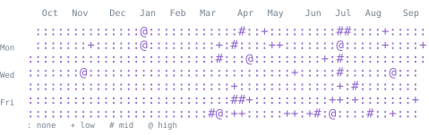

  

  <a href="https://www.linkedin.com/in/narasimha31/">LinkedIn</a> &nbsp;·&nbsp;
  <a href="https://narasimharoyal.com/">Portfolio</a> &nbsp;·&nbsp;
  <a href="mailto:narasimharoyal31@gmail.com">narasimharoyal31@gmail.com</a>

I'm a data analyst in Houston. My job is turning messy, multi-source data into numbers people can actually make decisions on, and I care most about the part most people skip: making sure those numbers are right before anyone bets on them.

That matters more in the AI era, not less. A prompt can write the query and draw the chart, but it can't tell you the chart is lying. That gap is where I work: framing what the numbers mean, deciding which one to trust, and turning it into a call a stakeholder can act on. I use AI tools daily to move faster, and I check everything they produce before it ships.

Most of my day is **Python** and **SQL**: validation queries, reconciliation checks, and BI reporting. When a project needs the pipeline underneath, I build that too, which is where the engineering tools below come in.

**Languages**
`Python` `SQL`

**Analytics & BI**
`Power BI` `Tableau` `Pandas` `Excel`

**Databases & Warehouse**
`PostgreSQL`  `BigQuery` `Oracle` `Databricks`

**Pipelines & Data Quality**
`Apache Airflow` `dbt` `Apache Kafka` `Great Expectations` `Docker`

### [Energy Storage Inventory Analytics](https://github.com/narasimha-31/tesla_energy_inventory_analytics)
A three-page Power BI dashboard on a PostgreSQL star schema, tracking inventory across Tesla's energy storage factories. The quarterly totals are real, taken from Tesla's SEC filings; the daily warehouse movements are simulated in Python and constrained so every quarter sums back to the exact figure Tesla reported. One page each for operations, leadership, and finance, so every audience sees only the answers they actually ask for.
> `Python` `PostgreSQL` `Power BI (DAX)` `SQL`

### [Supply Chain Risk Analytics with AI Agent](https://github.com/narasimha-31/semiconductor_dataengineering)
Ask a supply-chain question in plain English, get an answer computed live from 16 years of US government data. A pipeline pulls three government APIs (Census Trade, Federal Register, SEC EDGAR) through Kafka into a PostgreSQL warehouse modeled with dbt, gated by Great Expectations, and reconciled to **0.00% variance** against published federal totals. A Grok-powered text-to-SQL chatbot on BigQuery serves the answers behind strict guardrails, including quantifying a **29.7% drop** in US memory-chip imports after the Oct 2022 export controls.
> `Python` `SQL` `Kafka` `Airflow` `PostgreSQL` `dbt` `BigQuery` `Grok AI` `Great Expectations` `Docker`

### [Review Sentiment & Fake Review Detection](https://github.com/narasimha-31/Amazon_Reviews_ETL_Analytics)
Analyzed **44.2M Amazon reviews** through a Bronze → Silver → Gold PostgreSQL warehouse, with a dead-letter queue isolating ~6,200 malformed rows so bad data never reached reporting. A fake-review risk model flagged **1,037 suspicious reviewers** across 3.2M profiles, surfaced in a 3-page Power BI dashboard.
> `Python` `PostgreSQL` `Airflow` `Docker` `VADER` `Power BI`

  

